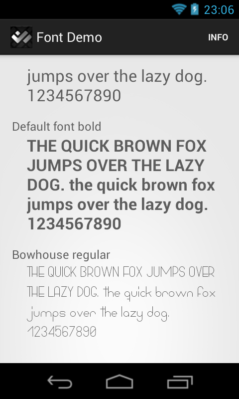

DroidCustomFont
===============

The DroidCustomFont is an Android library project that provides simple view elements (currently only supports `TextViews`) that allow the simple usage of different cutom fonts.


Project overview
----------------
* [lib](https://github.com/friederikewild/DroidCustomFont/tree/master/lib) - The library project that can be referenced from an Android project.
* [sample](https://github.com/friederikewild/DroidCustomFont/tree/master/sample) - An Android demo app that demonstrates how to use the DroidCustomFont.



About the idea
--------------

Android 4.0 introduced "Roboto" as new standard font for Android devices. As his predecessor "Droid", the font was designed to look good on mobile displays and using it leads to an Android look&feel.

Sometimes this is just not what one is looking for. Mabe a customer has a corporate font that is needed to be used throughout an app. Or a very different font typeface is associated with a specific UI element e.g. a digital clock display using a red pixel-styled typeface reminds of an historical LED watch.

Using custom fonts with Android is sadly not directly possible via xml layouts. Instead the developer is forced to do the following lines for every `TextView`:

```java
// Load each font that shall be used in the following way
Typeface font = Typeface.createFromAsset(getAssets(), "font_name.ttf");
// Find each text view that shall use custom fonts
TextView textView = (TextView)findViewById(R.id.textview);
// Assign the font as typeface
textView.setTypeface(font);
```

This may be fine for one-time usage as in the watch example. But with the corporate designed app this manual modifcation of each `TextView` is very time-consuming, error-prone and requires an unique id for each `View`, even when it only contains static text.

In addition the layout files do not represent the real font usage and lead to bad readability of the project. Not only is the font name missing from the layouts, but there is another problem hidden: The Android system is not supporting to change the style of a font when using a custom typeface. Applying for example `android:textStyle="bold"` doesn't trigger the expacted font appearance. Instead each `TextView` must be assigned the according typeface e.g. "regular", "light", "bold" of the same font family.

To simplify this process DroidCustomFont was created. 

Please keep in mind that using custom fonts can lead to the following potential bugs:

* Needed special characters (e.g. #) might be missing
* Internationalization might not be fully supported
* [Ellipsizing](http://developer.android.com/reference/android/widget/TextView.html#attr_android:ellipsize) can fail too, in case the special ellipsis character is not included in the font.

Therefore additional testing is strongly recommended!


How to use
----------


###Getting Started (Eclipse)
Import the DroidCustomFont project to your workspace and add a reference to it from your project. All needed steps can be found at [developer.android: Referencing a library project](https://developer.android.com/tools/projects/projects-eclipse.html#ReferencingLibraryProject)


### Integration

* Store all needed custom fonts as TTF files in "assets/fonts". At the moment this folder structure is mandatory. This may change in future versions of the library.
**Important: ** Only include fonts with a suitable license!

* The base element of each layout xml file, that shall use custom fonts needs the app packagename as additional namespace (if not already present). In this example the packagename is "de.devmob.androlib.customfont.demo". The prefix can be chosen as wanted. Through this example "app" is used
```java
xmlns:android="http://schemas.android.com/apk/res/android"
xmlns:app="http://schemas.android.com/apk/res/de.devmob.androlib.customfont.demo"
```

* Whenever a `TextView` is needed, use instead the class `CustomFontTextView` from the library . It can be layouted and styled in exactly the same way (except for `android:typeface` and `android:textStyle`).

* To assign a custom typeface via the complete filename use `app:fontname`
```java
<de.devmob.androlib.customfont.CustomFontTextView
    app:fontname="bowhouse_regular.ttf"
```

This replaces the need of assigning the custom font via code for each `TextView`.


Developed By
------------

* The initial version was written by <a href="https://plus.google.com/117518039262793648233?rel=author">Friederike Wild</a> - <friederike.wild@devmob.de>

* Used Fonts (Both under a Creative Commons Licence including for commercial use):
  * Bowhouse Font Family. Created 2013 by PYRS Fontlab Ltd. 
  * BPdotsUnicase. Created 2007 by George Triantafyllakos ([Backpacker.gr](http://backpacker.gr))
  

License
-------

    Copyright 2013 Friederike Wild

    Licensed under the Apache License, Version 2.0 (the "License");
    you may not use this file except in compliance with the License.
    You may obtain a copy of the License at

       http://www.apache.org/licenses/LICENSE-2.0

    Unless required by applicable law or agreed to in writing, software
    distributed under the License is distributed on an "AS IS" BASIS,
    WITHOUT WARRANTIES OR CONDITIONS OF ANY KIND, either express or implied.
    See the License for the specific language governing permissions and
    limitations under the License.
